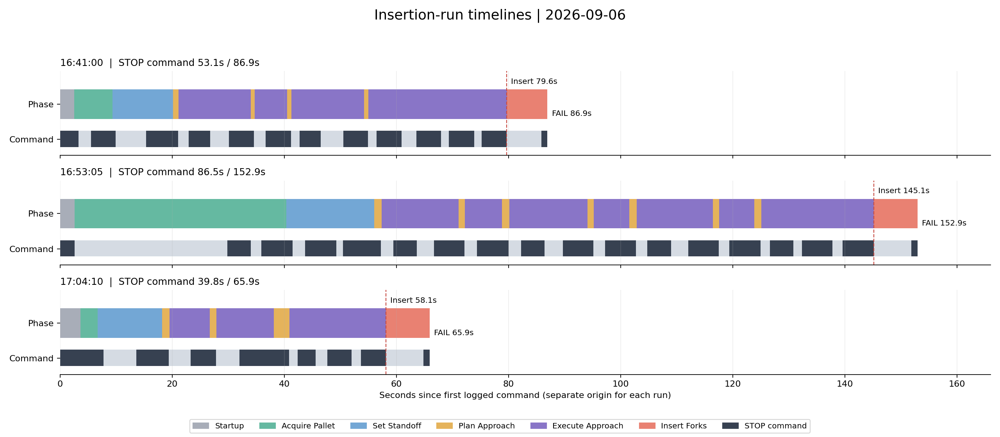

# ?? ?? FSM 3? ?? ?? ??

?? ??? 2026-09-06 16:41:00, 16:53:05, 17:04:10 ????. `begin.kind=v4_insert_segment`? ?? ??? ? ??? ????. READY ?? ?? ?? ??? ??? ??? ????. ? ?? ?? ?? ??? `RECOVER_VISUAL / PnP recovery timeout`??, ????? ??? ?? ??? ??? ? ??.

## ??? ??

- ?? ??? ? control_seq.jsonl? ? ?? ????. ? failure ????? ????. ?? ? ????? ?? ??? ?? ?? ? ?? ???? ????.
- ? ?? ?? ??? pallet_state.csv?? ?? ??? ?? ??? ?? ????. ?? ??? ??? ?? ??? ??. ?? ??? STOP ??? control_seq ?? ??? ????.
- STOP ??? ??? ??? ?? ?? ??? ??? STOP ?? ?? ????. ???? ???? ??? ????. ??? ??/?? ?? ???? ?? ?? ??? ????.
- RECOVER_VISUAL? ? ? ?? ?? ?? ?? ?????? Insert Forks? ????. READY? ?? ???? ???? ???? ??? ?? ?? ??? ?? ???.
- ?? meta.json ?? ??? ?? ??? ? ?? ?? False, ??? ??? 10?, PnP ?? ??? 1??. ?? ??? ?? ? ?? 3?, ??? ?? 2??. ?? ?? ??? ?? ??? ???? ???.

## ? ?? ?? ??

Plan? Execute? ?? ?? ??? ????. ? ?? ?? ?? ??? ?? ????.

| ?? | 16:41:00 | 16:53:05 | 17:04:10 |
|---|---:|---:|---:|
| ?? | 2.53? | 2.61? | 3.64? |
| ??? ????? ?? | 6.84? | 37.77? | 3.03? |
| 4m ?? ?? ?? | 10.78? | 15.66? | 11.50? |
| ?? ????? ?? | 3.19? | 8.66? | 5.33? |
| ????? ?? | 56.36? | 80.45? | 34.59? |
| ?? ? ?? ?? | 7.20? | 7.80? | 7.81? |
| ?? | 86.91? | 152.94? | 65.91? |
| ?? ?? ?? | t+79.64? | t+145.14? | t+58.09? |
| STOP ?? ?? | 53.08? (61.1%) | 86.55? (56.6%) | 39.80? (60.4%) |

## ?? ??? ??? ??

?? ? STOP ? ?? ?? ?? ? ??? 10? ?? ?? ?? ? ??/?? ?? ???? ?? ?? ? ?? ?? ???. Plan ??? ?? ??? ?? ????? CPU ?? ???? ???? ? ??. ?? ?? ??? ???? ?? ??? ??? ?????? ???.

| ?? | 16:41:00 | 16:53:05 | 17:04:10 |
|---|---:|---:|---:|
| ?? ? ?? ? ?? ?? ?? | 11 | 15 | 6 |
| STOP??? ?? ?? ?? | 41.92? | 63.80? | 21.94? |
| ??? ?? ?? ?? ?? | 33.0? | 45.0? | 12.0? |
| ??? ????????? ?? | 8.92? | 18.80? | 9.94? |

? ?? ?? ?? 127.66?? ?? 305.75?? 41.8%, STOP ?? 179.43?? 71.1%?. ?? ?? ?? ??? ??? 90??. ?? ??, ?? ??? ???, ??? ?? ??? ? ?? ?? ??? ???.

### ??? ?? ??

- **16:41:** t+5.49~9.89?? STOP 4.41?? FACE ?? ? ?? ?? ? 3.77?? ?? ?? ?? ? 0.64?? ????. 11?? ?? ? ?? ??? ???? ??? STOP??? ??? 3.8~4.5?? ???. t+67.92~78.89??? ?? ?? ?? ? ?? ????.
- **16:53:** t+2.61~29.84?? STOP? ??? ??? ?? ?? 27.23??. ?? ??? `full_front_visible`; ?? ?? ?? ???? ?? ???? ???? ???. t+72.13, 95.09, 117.48?? ??? ?? ??? ? ? ????, ?? ??+?? ??? 6.47/6.33/6.22?(?? 19.02?)? ???. ?? ?? ??? ?? ?? ??? ???.
- **16:53 ?? ???:** ? ?? ?? ? Z=4.132m? 4.0?0.1m ??? ?? ????, ? 0.117m ??? ? ?? ??? ????. ? ?? ?? 1.17?? ?? ?? 4.20?? ???. ?? ??? ?? ???? ? ?? ?? ????? ??? ????.
- **17:04:** t+31.97~40.83?? STOP 8.86?? ?? ?? ???. ?? ? STOP??? ?? 6.06? + ?? ?? ?? 2.80??. ? ?? 56??? ? ??/PnP ?? 20?(35.7%), ? ?? 24? ? 10?(41.7%)??. ?? ?? ??? PnP ?? ??? ???? ? ??? ??? PnP ?? ????? ? ? ??. ?? ????? Z? ? 2.33m ?????, ?? ??? ??? ??? ??? ??? ??? ??? ??? ????. ?? ?? ??? ??/??/?? ??? ? ??? ??? ? ??.

### ?? ?? ??

?? ?? ?? ?? ??? 6.23 / 6.74 / 6.74???. ?? STOP ???? 1.03 / 1.06 / 1.08?? ? ???? PnP recovery timeout?? ????. ?? ??? fitted duration? ? 7.57 / 8.14 / 7.91? ????, ??? ?? summary.json actions.params? ????. ?? ??? ?? ?? ?? ??? ???? ????, ??? ?? ?? ??? ??? ??? ??? ???? ???. ?? ??? ?? ?? ?? ??/PnP ?? ??? ? ?? ??? ???? ??. ? ??? ?? ? ????? ?? ??? ???? ??? ???.

## ??? ?? ??

? ??? ???? ??? ?? ???? 16/31/31ms, P95? 31/47/47ms?. ??? ??? ?? ??? ?? ?? ???? 47/94/109ms?. ?? ?? ??? ?? 30fps??? FSM? ?? ? ??? ?? ???? ??? ??? ??. ?? ??????????PnP????????? ??? ?? ?? ???? ??? ?? ?? ?? ?? ?? ???? ?? ? ??. ??? ??? ?? ??? ??? ?? ???? ?? ??? ??? ?? ??? ???.

?? ??? ? ?? CAN movement write? ????. 0.50~0.83?? ? ??? ?? ? ? STOP?? ???, ?? ?? ????? 0.1? ?? ??? ?? ???. ? ?? ???? ??? CAN ?? ?? ???? ???? ???.

## ?? ????

1. **?? STOP ???? ?? ??? ???.** SETTLE?? ??? ??? pose? ?? ?? ?? PLAN/FINAL_POSE_LOCK? ????, ? ?? ? ?????? ??? ??? ?? 10?? ??? ???. ?? ???? ???? ? 0.6~1.3?? ?? ??? ?? ???. ??? ?? ??? ?? ?? ID? ???? ?? ?? ? ??? ????? ? ??. ???? ?? ???? ????.
2. **??? ??? waypoint ??? ?? ??.** ??? ??? ??? ?? ????? ??? ????, ??? ???? ???? ?? ? ??/?? ??? ?? ??? ????. 16:53? ??? ?? ? ?? ?? ??+?? ??? 19.02??. ?? ?? ????? ?? ???.
3. **??? ??? ?? ?? ??.** 17:04 t+32~41? ?? ??? ????/?? ???? ???? ?? ?????? ?? ??? ????. ?? ???? ?? ???? ?? ??? ????. ?? ???? ??? ??? ?? ? ??.
4. **?? ?? ???? ??? ??.** ?? ??? ?? 2??. ?? ? ??? 3?2? ??? ?? ??? ???? ?? ?? ???? ????? 11?/15? ?? ??? ???, ?? ??? ??? ???? ??? ??? ???? ?? ??? ??. ?? ??? ?? ? ?????? ??? ? ?? ???? ????.
5. **?? ??? 4m ?? ??? ?? ??.** ?? ??? ?? ? ?? ???? ?? ??? ??? ?? ? ??? ????. 4m ????? ?? ?? ? ???? ??? ?? ?? ??? ???? ???? ? ?? ??? ???. ???? ??? ??/??? ?? ?? ? ????.
6. **?? ?? ? ?? ??.** ?? ??? ?? ?? ??? ?? ??, ?? CAN ?? ????, ?? ??? ????. PnP ??? ?? ?? ??? ??? ??? ??? ???.

## ?? STOP ??

?? ?? ?? ?? ???? ?? ??? ??? ?? ??? ????. ?? ?? ?? ??? ? `*_states.csv`?, ?? ??? `*_commands.csv`? ??.

### 2026-09-06T16:41:00.959

| ?? t+? | ?? t+? | STOP ?? ? |
|---:|---:|---:|
| 0.000 | 3.266 | 3.266 |
| 5.485 | 9.891 | 4.406 |
| 15.313 | 21.016 | 5.703 |
| 22.953 | 26.766 | 3.813 |
| 30.125 | 34.547 | 4.422 |
| 36.688 | 41.188 | 4.500 |
| 42.703 | 46.485 | 3.782 |
| 50.500 | 54.922 | 4.422 |
| 56.453 | 60.891 | 4.438 |
| 63.563 | 67.922 | 4.359 |
| 69.375 | 73.844 | 4.469 |
| 75.172 | 79.641 | 4.469 |
| 85.875 | 86.906 | 1.031 |

??: [control_seq.jsonl](../../extracted/depth_cam/rec/forklift_v4_recording_20260906_164100_control_seq.jsonl) ? [pallet_state.csv](../../extracted/depth_cam/rec/forklift_v4_recording_20260906_164100_pallet_state.csv) ? [inference_timing.csv](../../extracted/depth_cam/rec/forklift_v4_recording_20260906_164100_inference_timing.csv) ? [meta.json](../../extracted/depth_cam/rec/forklift_v4_recording_20260906_164100_meta.json)

### 2026-09-06T16:53:05.897

| ?? t+? | ?? t+? | STOP ?? ? |
|---:|---:|---:|
| 0.000 | 2.609 | 2.609 |
| 29.843 | 34.000 | 4.157 |
| 35.922 | 41.484 | 5.562 |
| 43.672 | 49.297 | 5.625 |
| 50.468 | 57.234 | 6.766 |
| 59.437 | 63.640 | 4.203 |
| 66.672 | 72.125 | 5.453 |
| 74.375 | 80.000 | 5.625 |
| 82.203 | 86.390 | 4.187 |
| 89.718 | 95.093 | 5.375 |
| 97.187 | 102.718 | 5.531 |
| 104.734 | 109.000 | 4.266 |
| 112.047 | 117.484 | 5.437 |
| 119.406 | 124.937 | 5.531 |
| 126.593 | 130.781 | 4.188 |
| 132.375 | 137.797 | 5.422 |
| 139.593 | 145.140 | 5.547 |
| 151.875 | 152.937 | 1.062 |

??: [control_seq.jsonl](../../extracted/depth_cam/rec/forklift_v4_recording_20260906_165305_control_seq.jsonl) ? [pallet_state.csv](../../extracted/depth_cam/rec/forklift_v4_recording_20260906_165305_pallet_state.csv) ? [inference_timing.csv](../../extracted/depth_cam/rec/forklift_v4_recording_20260906_165305_inference_timing.csv) ? [meta.json](../../extracted/depth_cam/rec/forklift_v4_recording_20260906_165305_meta.json)

### 2026-09-06T17:04:10.624

| ?? t+? | ?? t+? | STOP ?? ? |
|---:|---:|---:|
| 0.000 | 7.704 | 7.704 |
| 13.610 | 19.375 | 5.765 |
| 23.297 | 27.782 | 4.485 |
| 31.969 | 40.829 | 8.860 |
| 42.391 | 45.579 | 3.188 |
| 47.688 | 51.985 | 4.297 |
| 53.672 | 58.094 | 4.422 |
| 64.829 | 65.907 | 1.078 |

??: [control_seq.jsonl](../../extracted/depth_cam/rec/forklift_v4_recording_20260906_170410_control_seq.jsonl) ? [pallet_state.csv](../../extracted/depth_cam/rec/forklift_v4_recording_20260906_170410_pallet_state.csv) ? [inference_timing.csv](../../extracted/depth_cam/rec/forklift_v4_recording_20260906_170410_inference_timing.csv) ? [meta.json](../../extracted/depth_cam/rec/forklift_v4_recording_20260906_170410_meta.json)

??: ??? ???? `python tools/analyze_insertion_timing.py` ??. summary.json?? ? ??? ?? params/result? ????.
