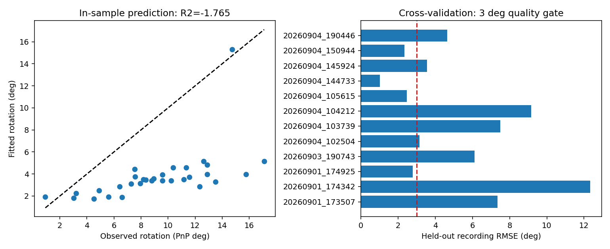
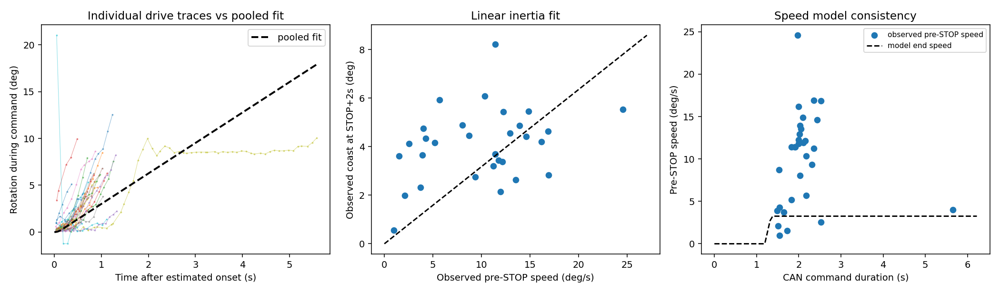

# C4 직접 추론 및 회전 응답 함수 검증

결론: 23개 영상 직접 추론과 함수 적합을 완료했지만, 현재 결과는 `DIAGNOSTIC_ONLY`입니다. 제어 적용 기준을 통과하지 못해 배포하지 않았습니다.

## 입력과 실행

- C4: `training/symmetry/models/pallet_yolo26n_pose_v4_c4_ft_selected.pt`
- SHA-256: `35033fa0137084da6fa1814e1d16daf5a96fcd053e46dd045f672e9289f0d96c`
- 기존 전체 영상 C4 비교에 사용한 체크포인트와 동일합니다.
- 입력: `rotation_fit/out/command_clips`의 23개 무손실 영상, 4,163프레임, 74개 CAN 회전 구간.
- GPU: RTX 3060 Laptop, torch 2.7.1+cu118, ultralytics 8.4.138, FP16, confidence 0.30.
- 배치 추론 시간: 144.08초(모델 초기화 전후 일부 시간 제외).
- 시간과 각도: 원본 `frame_i`로 촬영 시각 결합, CAN write-return 경계, `yaw_deg`/`heading`, 360도 주기.
- 명령 세기: 중립 127에서 30만큼 변위. 교정된 물리 토크 30 N·m라는 의미가 아닙니다.
- 진단을 위해 저검출 영상도 로그를 저장하는 `--allow-low-pose`를 사용했습니다. 그 영상은 별도 검증과 최종 적합에서 실패로 기록됐으며 적용 기준을 완화하지 않았습니다.

## 추론 로그 품질

유효 자세 4,087/4,163프레임(98.17%). `20260903_191906`은 59프레임 모두 자세가 없어 독립 로그 검증에 실패했습니다. 적합기는 이를 기록 오류로 남기고 나머지 영상에 대한 진단을 계산했습니다.

튐은 유효한 연속 출력 프레임 간 실제 호스트 촬영 간격이 0초 초과 0.35초 이하이고, 360도 주기로 보정한 yaw 변화가 5도를 넘는 경우로 정의했습니다. 분리 영상의 잘라낸 간격과 검출 실패 프레임을 가로질러 비교하지 않습니다. 이는 이상 후보를 찾는 기준이며 실제 각도 정답을 대신하지 않습니다.

5도 초과 변화는 5개 영상에서 16건, 30도 초과는 3개 영상에서 5건이었습니다. 한 번 튄 프레임의 진입과 복귀는 각각 한 건입니다.

| 녹화 | 5도 초과 변화 | 최대 한 단계 변화 | 상세 확인 |
|---|---:|---:|---|
| 20260904_142318 | 3 | 51.86° | 원본 frame 223→224→225: 7.29→−44.57→4.85°. 재추론에서 선택 면 x_min→z_min→x_min 확인 |
| 20260901_174925 | 4 | 41.47° | 원본 frame 1503→1504→1505: 0.85→41.89→0.43°. 선택 면 z_min→x_min→z_min 확인 |
| 20260903_192254 | 6 | 32.49° | 검출 실패 직후 큰 자세 변화. 재추론에서 면은 같아도 yaw와 PnP inlier 수가 달라짐 |
| 20260904_150944 | 2 | 22.25° | 원본 frame 279→280→281: −3.19→19.05→−3.21°. 면은 x_min 유지, PnP 사용점 9→7→9 |
| 20260901_173507 | 1 | 상세 CSV 참조 | 5도 초과 변화 1건 |

특히 `142318`의 튄 프레임은 재투영 RMS가 약 1.02px로 낮았습니다. 따라서 낮은 재투영 오차만으로 올바른 3D 방향이라고 판단할 수 없습니다. 영상에서는 키포인트 대응이 일시적으로 달라지고 PnP가 선택한 면도 바뀌므로, 일부 큰 튐은 실제 차량 회전이 아니라 추정 불연속이라는 강한 증거입니다. 모든 튐이 면 전환 때문인 것은 아닙니다.

[전체 영상별 수치와 그래프](audit/REPORT.md) · [튀는 프레임 목록](audit/jump_events.csv) · [재추론 키포인트·면 선택 기록](audit/jump_frame_probes.json)

## 적합도

74개 명령 구간 중 실패 영상의 1개 구간은 분석할 수 없어 73개를 분석했고, 구동 및 관성에 각각 31개 구간을 사용했습니다. 명령 전 기준 프레임 부족, STOP 전 지속 움직임 미검출 등은 기존 적합기 기준에 따라 제외됐습니다. 교차검증은 이 사용 가능 구간을 제공한 12개 녹화를 대상으로 12회 모두 계산됐습니다.

| 지표 | 결과 | 해석 |
|---|---:|---|
| 최종 회전각 적합 RMSE | 6.289° | 적합에 쓴 31개 구간에서의 오차 |
| 최종 회전각 적합 R² | −1.765 | 같은 관측의 평균값 예측보다 나쁨 |
| 녹화별 동일 가중 교차검증 RMSE | 6.110° | 적용 기준 3.0° 초과 |
| 구간별 가중 교차검증 RMSE | 7.159° | 구간이 많은 영상의 영향이 더 큰 별도 집계 |
| 최종 회전각 평균 편향 | −5.435° | 전반적인 과소예측 |
| 명령 유지 구간 곡선 RMSE | 2.756° | 전체 최종 회전각 오차와 다른 지표 |
| 관성 회귀 RMSE | 2.078° | 관측된 STOP 직전 속도로 관성을 설명할 때의 오차 |



오차가 특히 큰 검증 녹화는 `20260901_174342`(12.33°), `20260904_104212`(9.17°), `20260904_103739`(7.50°)입니다. 순간 튐이 가장 큰 영상과 적합 오차가 큰 영상은 같지 않습니다.

## 추출된 진단용 함수

[계수 및 계산식 JSON](audit/diagnostic_function.json)은 런타임 배포 형식이 아닌 진단용 자료입니다.

| 계수 | 추정치 | 녹화 단위 bootstrap 200회 95% 구간 |
|---|---:|---:|
| 명령 후 움직임 지연 | 1.1941s | 1.0444~1.2372s |
| 가속도 | 21.6897°/s² | 11.3369~30.9169°/s² |
| 가속 지속시간 | 0.1500s | 0.1500~0.6622s |
| 최대 회전속도 | 3.2535°/s | 1.8467~9.2808°/s |
| 관성 기울기 | 0.31774s | 0.28949~0.43828s |

명령 시간 T에 대해 q=max(0,T−1.1941), r=min(q,0.15)라 두면:

```text
명령 중 회전각 = 0.5 × 21.6897 × r² + 3.2535 × max(0, q−0.15)
종료 속도     = min(3.2535, 21.6897 × q)
관성 회전각   = 0.31774 × 종료 속도
최종 회전각   = 명령 중 회전각 + 관성 회전각
```

이 식은 검증에서 실패한 후보이므로 목표 각도 제어에 사용하면 안 됩니다. 가속시간 0.15초는 탐색 하한과 일치합니다. 현재 코드의 `identifiable=true`는 이 하한 도달을 걸러내지 않으므로 가속도/가속시간이 충분히 식별됐다고 해석할 수 없습니다.

관측 STOP 직전 속도는 0.96~24.58°/s인데 모델의 최대 속도는 3.25°/s입니다. 관성 회귀 자체의 오차보다, 공통 구동 곡선이 종료 속도를 낮게 예측하고 이를 관성 계산에 넣는 전체 경로의 불일치가 큽니다. 녹화별 곡선의 차이와 적합 가중치·지연 검출·구간 분리를 추가 검토할 필요가 있습니다.



## 튀는 영상 제외 시 민감도

5도 초과 튐이 있는 5개 영상과 자세 실패 영상 1개를 제외한 사후 참고 실험에서는 22개 적합 구간, 9개 녹화 검증의 RMSE가 **6.675°**였습니다. 따라서 튀는 영상만 제거해도 현재 단일 회전 응답 함수의 적합도 문제가 해결되지는 않습니다. 이 실험은 결과를 본 뒤 고른 부분집합이므로 독립적인 성능 검증이나 적용 후보로 취급하지 않습니다.

[제외 목록과 참고 실험 결과](audit/sensitivity_without_jump_videos.json)

## 검증 범위와 다음 개선점

이번 오차의 기준은 C4가 추론한 PnP 각도입니다. 실제 차량 회전각의 독립 정답은 없으므로 물리 정확도가 검증된 것은 아닙니다. 또한 학습 데이터 manifest와 대조하면 이번 녹화 중 train에 4개, val에 2개, test에 2개가 포함됩니다. 녹화 단위 교차검증은 응답 함수의 교차검증이지, C4 모델을 매번 재학습한 검증이 아닙니다.

우선 검토할 개선점은 (1) 물체 면/방향의 시간적 일관성과 PnP 다중해·키포인트 이상 대응 처리, (2) 정지 노이즈만으로 정한 가중치 및 단일 가속/최대속도 가정이 녹화별 차이를 설명하는지, (3) 가속시간 탐색 경계 도달과 STOP 직전 속도 오차를 품질 기준에 반영하는 것입니다. 이번 작업에서는 제어·적합 알고리즘을 변경하지 않았습니다.
