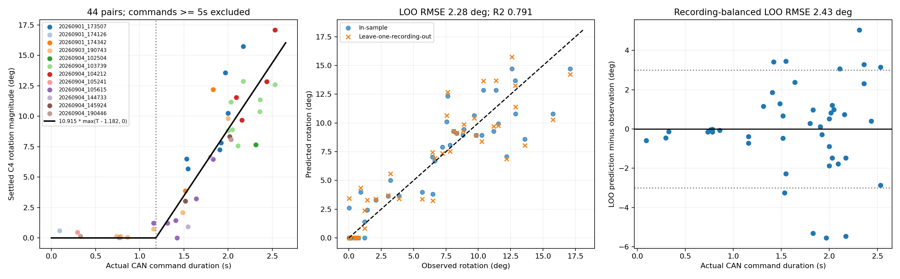

# 5초 이상 제외: 정지시간 + 선형 회전량 적합

기존 45개 endpoint 측정점에서 사용자 지정 조건 T >= 5s만 추가 제외했다. 원본 CSV는 변경하지 않았다.
입력 45점 → 제외 1점 → 적합 44점 / 12개 녹화. 좌우 통합, 토크 30 로그.

## 함수

θ(T) = 10.915434 × max(T − 1.181928, 0) [deg]

양의 목표각도에 대한 역함수: T(θ) = 1.181928 + θ / 10.915434 [s]. θ=0이면 명령시간 0.
측정 명령시간 범위: 0.093–2.531s. 5초 미만 전체가 검증된 것은 아니다.
기울기·절편을 동시에 추정한 최소제곱 회귀이며 각 명령 측정점에 동일 가중치를 적용했다.
정지시간 전 구간의 작은 관측값도 제외하지 않고 오차에 포함했다.

## 검증

| 방식 | RMSE (°) | MAE (°) | R² |
|---|---:|---:|---:|
| 동일 로그 적합 | 1.9972 | 1.4362 | 0.8399 |
| 녹화 전체를 하나씩 제외한 교차검증 | 2.2793 | 1.6559 | 0.7914 |

녹화별 동일 가중 교차검증 RMSE: 2.4350°. 기존 참고 기준 3°: 통과.
각 fold에서 정지시간과 기울기를 모두 다시 추정했다. 학습 시간범위 밖 1점도 제외하거나 클리핑하지 않고 검증에 포함했다.
이 수치는 현재 선택된 로그에 대한 응답함수 검증이며 독립 실측 및 새로운 환경 검증이 아니다.

## 제외점

- forklift_v4_recording_20260901_174342, step 7: 5.656s / 14.688°

## 해석과 제한

- 정지시간 1.1819s는 최종 회전량의 절편에서 얻은 **유효 지연시간**이다. 실제 움직임이 시작된 프레임을 직접 측정한 값과 같다고 할 수 없다.
- θ는 정지 후 안정 구간과 명령 전 안정 구간의 C4 각도 차이다. 관성이 포함되므로 이 기울기를 실제 최대 회전속도라고 단정하지 않는다.
- 기존 물리 구간 모델과는 예측 대상·포함 로그가 달라 과거 RMSE와 직접 비교하여 개선율을 주장하지 않는다.
- 원시 프레임 재추론/각도 재계산 없이 기존 endpoint를 사용했다. 이전 인식 또는 면 전환 오차가 남아 있을 수 있다.
- model.json은 오프라인 진단 결과이며 제어 설정과 실제 장비에는 적용하지 않았다.

