# 영상별 시간–각도 원본 점 그래프

23개 영상 전체를 포함합니다. 원본 영상 전체를 새로 추론한 것이 아니라, CAN 구간 중심으로 분리한 4,163프레임의 C4 추론 로그입니다. 그래프 안에서 이상 영상·이상 각도를 제외하거나 평활화하지 않았습니다.

X축은 원본 녹화 첫 프레임의 호스트 시각을 기준으로 한 경과 시간입니다. 유효 각도의 시간은 기존 적합기와 같은 센서→호스트 정렬 시각을 사용합니다. 잘라낸 구간의 시간 간격은 유지됩니다. Y축은 CSV의 yaw_deg 원래 값입니다(절댓값·누적 회전량·평활값 아님).

파란 점: 유효한 각도 추론 / 녹색 배경: CAN 회전 명령 유지 / 주황 점선: STOP+2초 / 아래 빨간 눈금: 자세 추정 실패(각도값 없음). 영상마다 Y축 범위가 다릅니다.

## 01. 20260901_173507

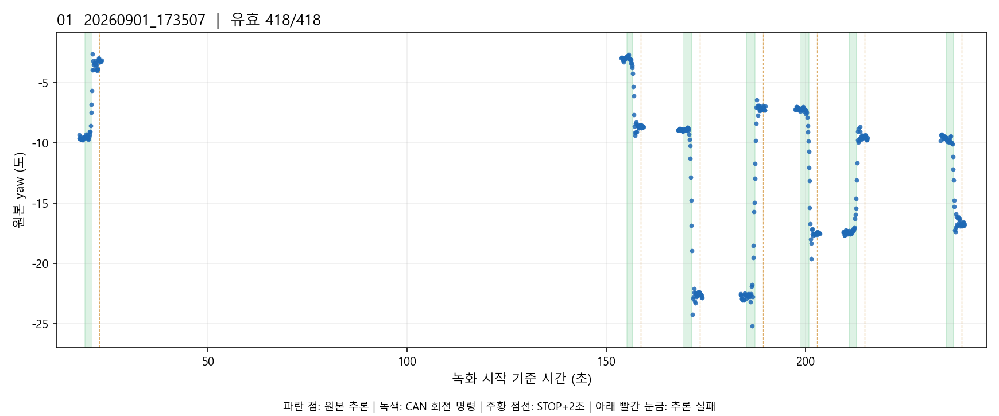

## 02. 20260901_174126

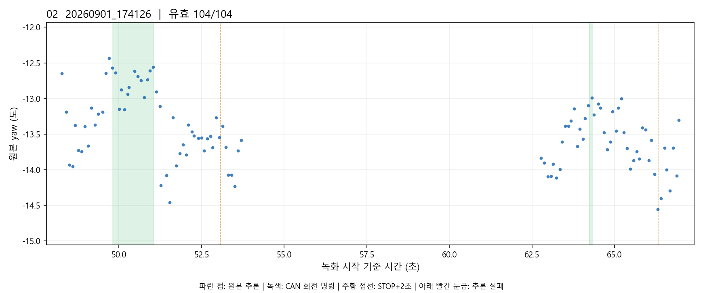

## 03. 20260901_174342

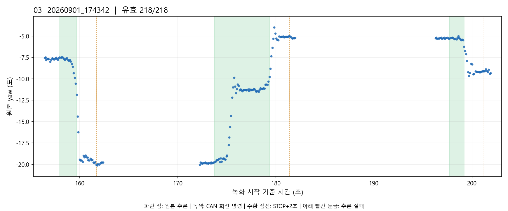

## 04. 20260901_174925

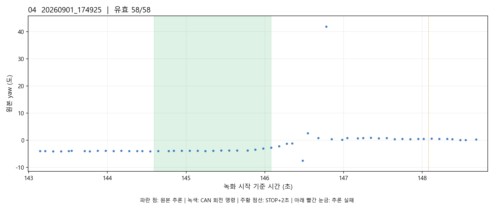

## 05. 20260903_190743

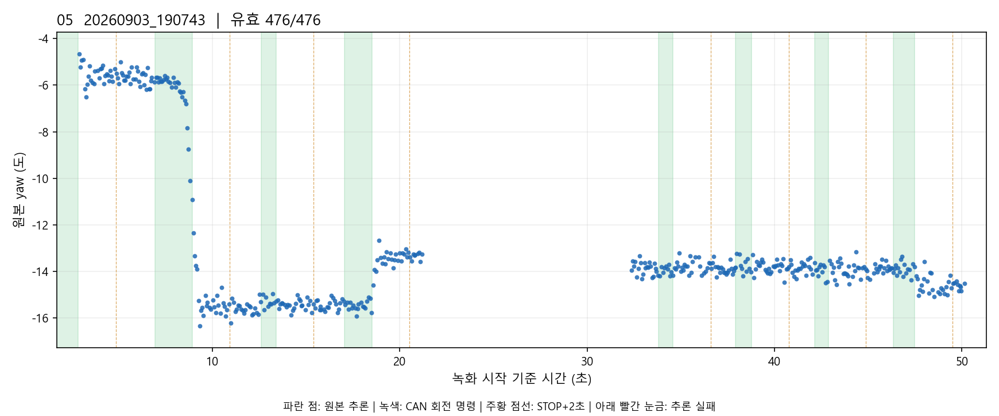

## 06. 20260903_191906

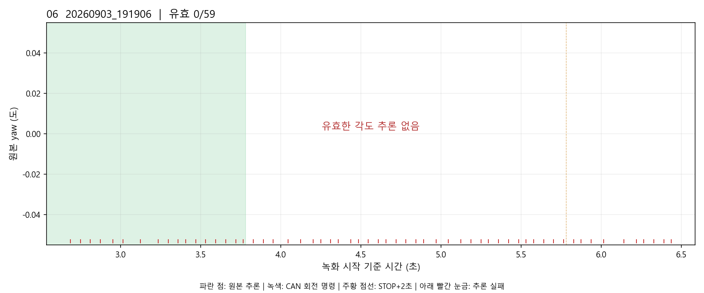

## 07. 20260903_192118

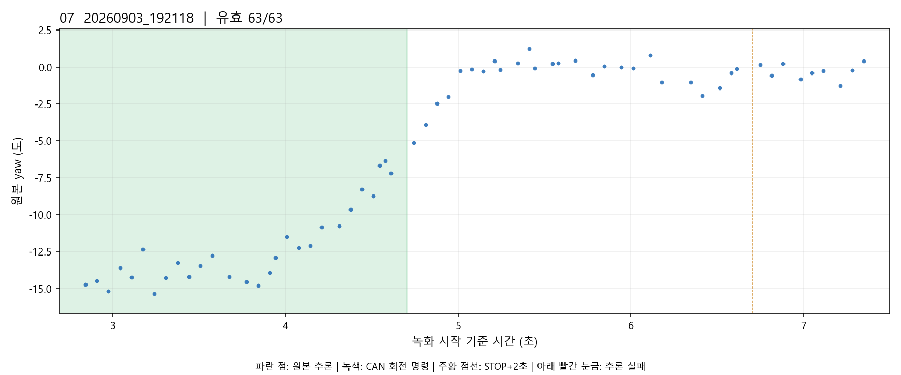

## 08. 20260903_192254

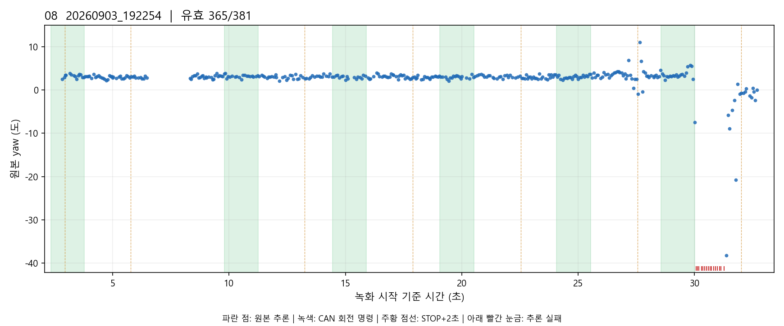

## 09. 20260904_102339

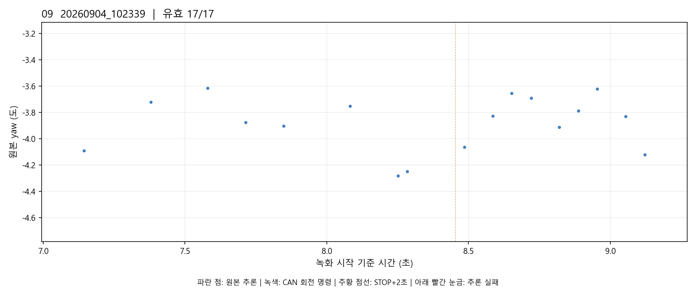

## 10. 20260904_102504

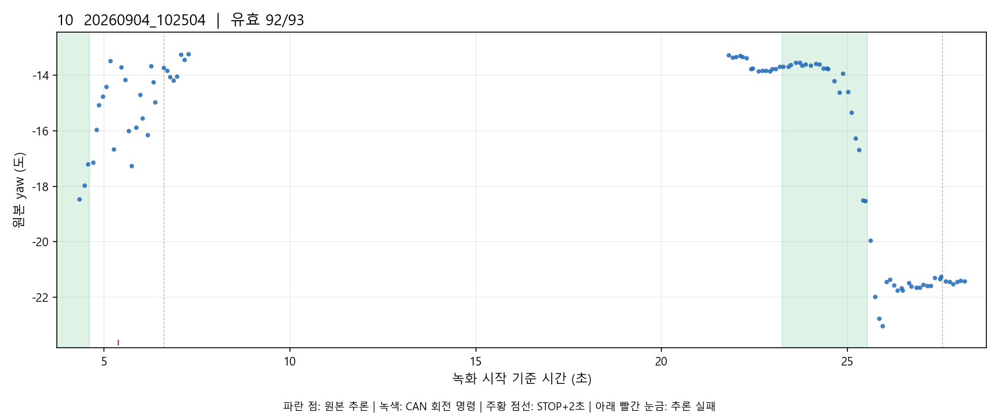

## 11. 20260904_102630

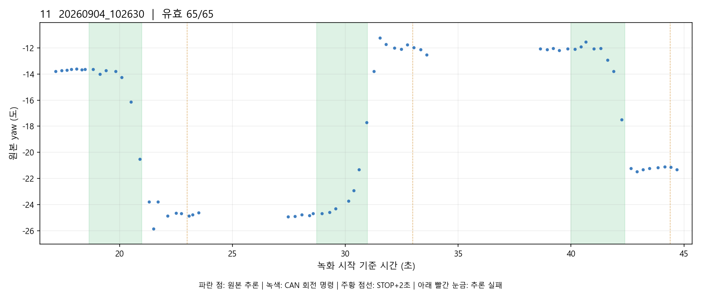

## 12. 20260904_103429

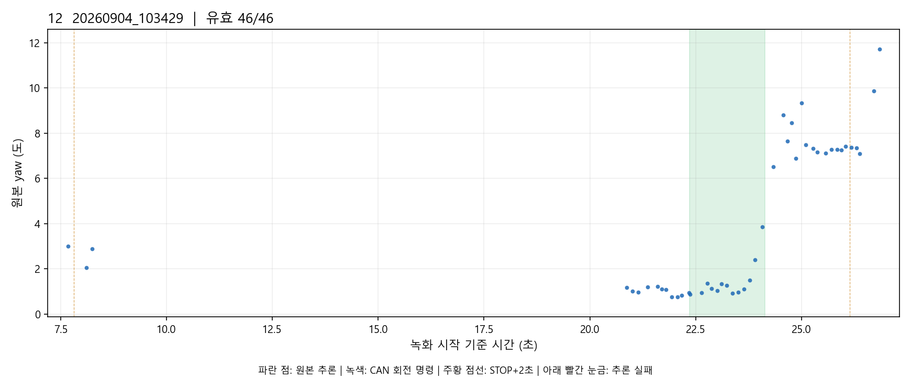

## 13. 20260904_103739

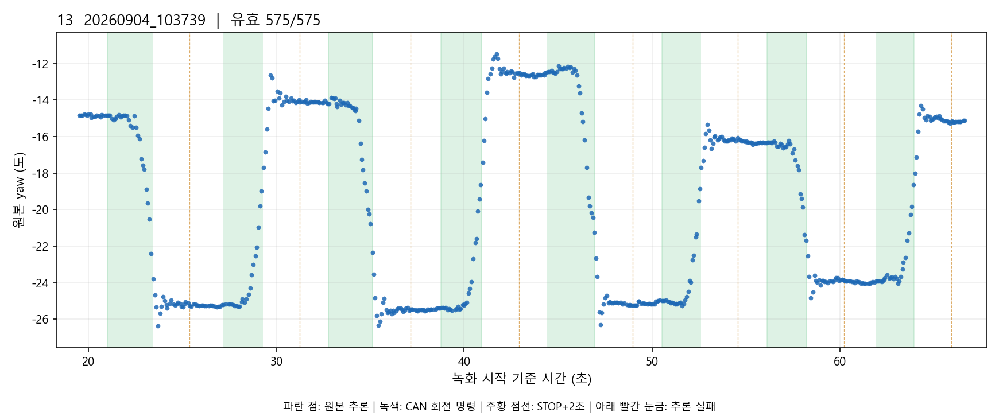

## 14. 20260904_104212

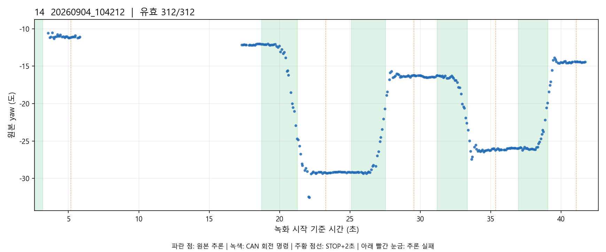

## 15. 20260904_105241

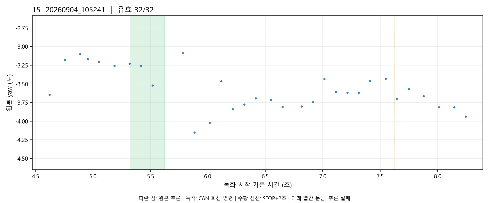

## 16. 20260904_105508

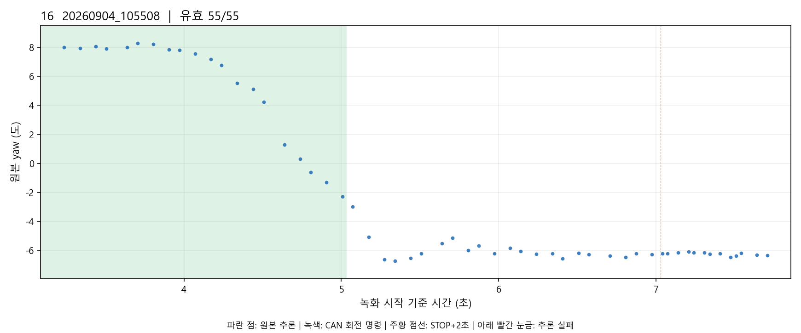

## 17. 20260904_105615

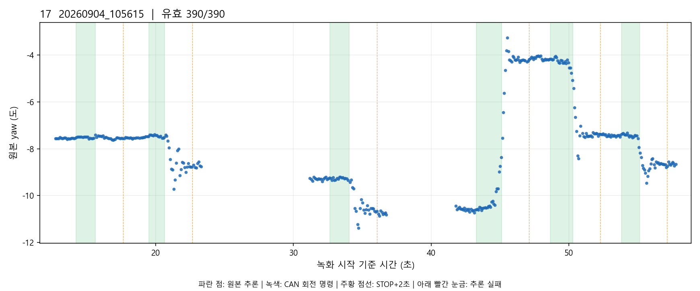

## 18. 20260904_142318

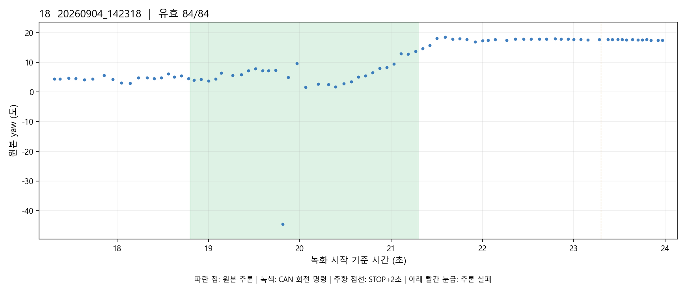

## 19. 20260904_144221

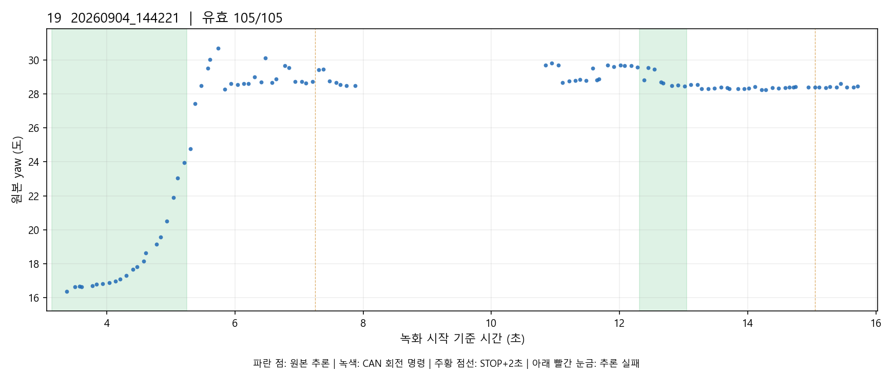

## 20. 20260904_144733

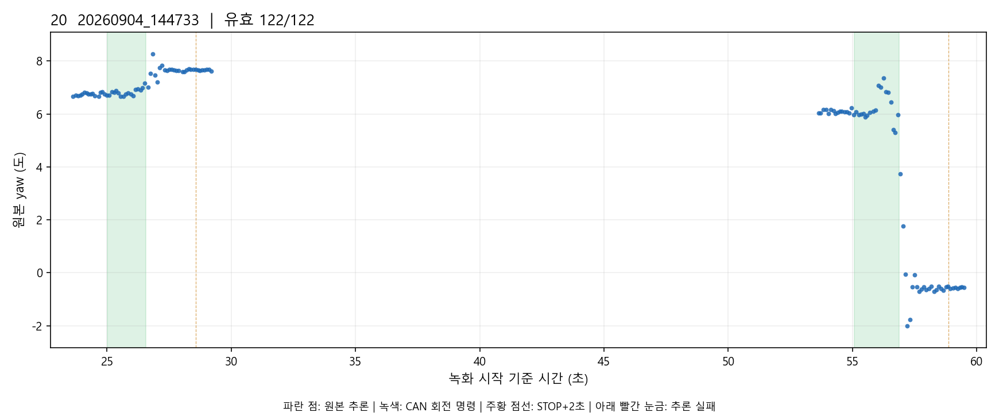

## 21. 20260904_145924

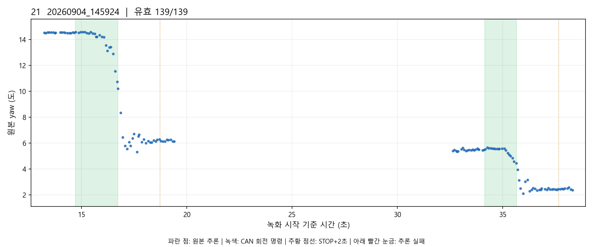

## 22. 20260904_150944

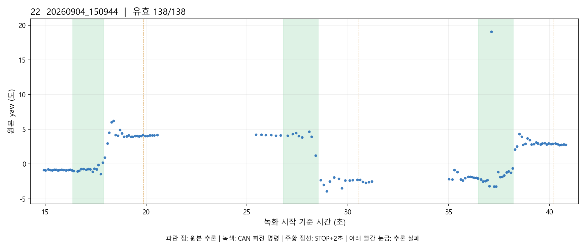

## 23. 20260904_190446

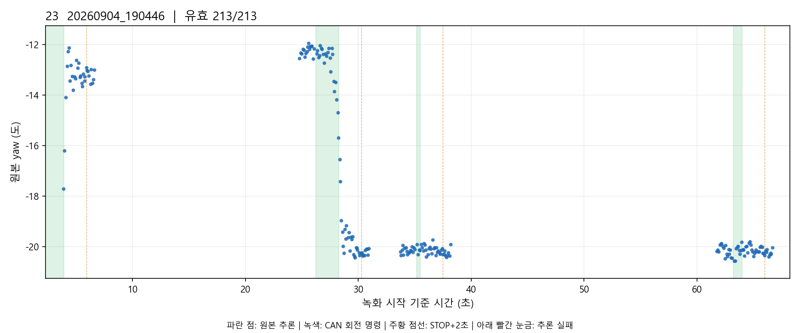
