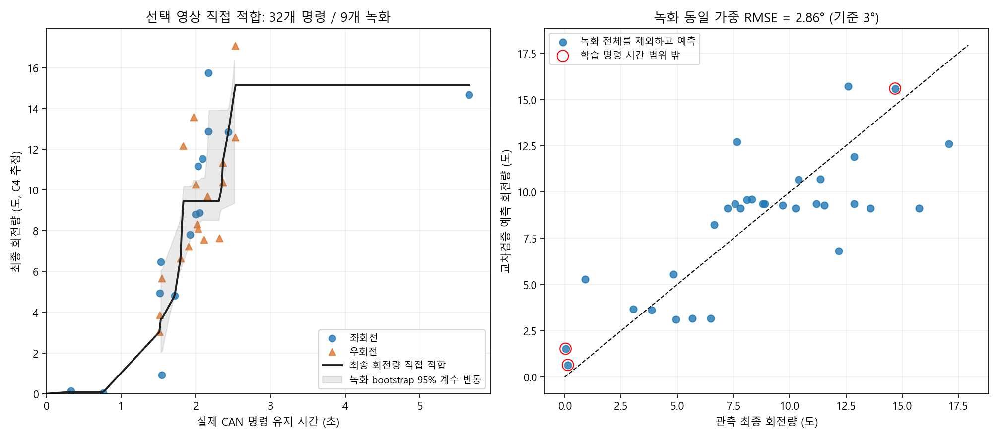

# 사용자 선택 영상 재적합 결과

선택 번호: **1, 3, 7, 10, 11, 12, 13, 14, 16, 18, 19, 20, 21, 22, 23**.

결론: 명령 시간→정지 전후 최종 회전량을 직접 적합한 함수는 녹화 동일 가중 교차검증 RMSE **2.858°**로 기존 3° 수치 기준을 근소하게 통과했습니다. 기존 가속·관성 분리 방식은 같은 영상으로 다시 적합해도 불합격입니다. 제어값 배포는 수행하지 않았습니다.

## 입력 및 선택

기존 C4 직접 추론 CSV를 재사용했습니다. 모델 SHA-256은 `35033fa0137084da6fa1814e1d16daf5a96fcd053e46dd045f672e9289f0d96c`입니다. 이번 작업에서 모델 추론 자체나 원본 로그를 변경하지 않았습니다.

영상 단위 선택은 사용자의 목록을 그대로 따랐습니다. 따라서 앞서 자동으로 이상 영상으로 분류했던 18번과 22번도 입력에 포함했습니다. 명령별 시작·종료의 안정성 조건은 이전과 동일하게 유지했습니다. 움직이는 중간의 순간 튐만으로 영상 전체나 명령 전체를 다시 제외하지 않았습니다.

| 번호 | 녹화 | 세기 30 명령 | 안정 종료점 조건 통과 |
|---:|---|---:|---:|
| 1 | 20260901_173507 | 7 | 7 |
| 3 | 20260901_174342 | 3 | 3 |
| 7 | 20260903_192118 | 1 | 0 |
| 10 | 20260904_102504 | 2 | 1 |
| 11 | 20260904_102630 | 4 | 0 |
| 12 | 20260904_103429 | 2 | 0 |
| 13 | 20260904_103739 | 8 | 8 |
| 14 | 20260904_104212 | 5 | 4 |
| 16 | 20260904_105508 | 1 | 0 |
| 18 | 20260904_142318 | 1 | 0 |
| 19 | 20260904_144221 | 2 | 0 |
| 20 | 20260904_144733 | 2 | 2 |
| 21 | 20260904_145924 | 2 | 2 |
| 22 | 20260904_150944 | 3 | 2 |
| 23 | 20260904_190446 | 4 | 3 |
| 합계 | 15개 녹화 | 47 | 32 |

9개 녹화가 32개 측정점을 제공했습니다. 7·11·12·16·18·19번은 입력에서 빠진 것이 아니라 명령별 안정 구간 검사를 통과한 쌍이 없었습니다. 제외 사유는 [전체 명령 CSV](endpoints/all_command_pairs.csv)에 기록했습니다. 명령 전 유효 프레임 부족, 종료 구간의 잔여 각도/위치 변화 등이 포함됩니다.

시작 각도는 명령 전 1초의 중앙값, 종료 각도는 STOP+2.7초 또는 다음 명령 직전 중 이른 시각까지 관측된 마지막 1초의 중앙값입니다. 최소 5개 프레임·0.6초 범위·프레임 간격 0.35초 이하, 각도 변화율 1°/s 이하, MAD 잡음 0.5° 이하, P90−P10 폭 1.5° 이하, 프레임 간 각도 변화 2° 이하, 위치 변화율 0.05m/s 이하 등의 조건은 변경하지 않았습니다. 종료 마지막 관측은 STOP 후 최소 1.5초여야 합니다.

## 새 함수의 형태

`회전량 = f(CAN 명령 유지 시간)`을 단조 증가 구간별 선형 함수로 적합했습니다. 좌·우를 합쳐 회전량의 크기를 학습했습니다. 각 녹화의 총 가중치를 1로 두어 명령이 많은 영상이 전체 적합을 독점하지 않도록 했으며, 명령 0초에서 회전량 0도의 기준점을 추가했습니다.

실제 함수는 [endpoint_model.json](direct_fit/endpoint_model.json)과 [분기점 CSV](direct_fit/function_knots.csv)에 저장돼 있습니다. 인접 분기점 `(T_i, A_i)`, `(T_j, A_j)` 사이에서는 아래 식으로 계산합니다.

```text
f(T) = A_i + (A_j-A_i) × (T-T_i)/(T_j-T_i)
```

이 함수는 가속도·지연·관성을 따로 추정한 물리 함수가 아니라, 이 데이터에서 명령 시간과 최종 관측 회전량의 관계를 설명하는 경험적 함수입니다. 목표 각도의 역함수는 해당 각도에 처음 도달하는 시간을 반환하며, 범위 밖 요청은 거부합니다. [진단용 역함수 표](direct_fit/diagnostic_inverse_table.csv)는 제어 검증을 마친 명령 권고가 아닙니다.

## 직접 적합 검증

각 녹화의 측정점을 모두 제외하고 나머지 녹화만으로 함수를 새로 적합한 뒤 제외한 녹화를 예측했습니다. 총 9개 녹화에 대한 9회 교차검증입니다. 모델 종류나 설정을 교차검증 점수가 좋아지도록 탐색하지 않았습니다.

| 지표 | 직접 적합 |
|---|---:|
| 학습 데이터 내 RMSE | 2.046° |
| 학습 데이터 내 R² | 0.772 |
| 녹화 동일 가중 교차검증 RMSE | **2.858°** |
| 명령별 집계 교차검증 RMSE | 2.686° |
| 명령별 집계 교차검증 MAE | 2.095° |
| 명령별 집계 교차검증 R² | 0.607 |
| 교차검증 절대오차 90백분위 | 4.488° |



개별 녹화 RMSE는 1번 3.54°, 3번 3.14°, 10번 5.05°, 13번 1.92°, 14번 2.56°, 20번 3.28°, 21번 1.01°, 22번 1.38°, 23번 1.25°입니다. 전체 평균 기준은 통과했지만 4개 녹화는 여전히 3°를 넘습니다.

## 기존 방식과 비교

기존 방식은 선택 15개 영상의 47개 명령 중 구동·관성 조건을 통과한 27개를 사용했고, 자체 STOP+2초 목표에 대한 녹화 동일 가중 교차검증 RMSE가 **6.688°**로 불합격이었습니다. [기존 방식 보고서](legacy/fit_report.json)

두 방식이 다른 개수의 명령을 사용하는 문제를 구분하기 위해, 추가로 **동일한 32개 안정 종료점 관측값**에 대해 검증했습니다. 각 검증 회차에서 두 방식 모두 해당 녹화 전체를 학습에서 제외했습니다. 학습은 각 방식이 사용할 수 있는 입력(기존: 구동 곡선, 새 방식: 안정 종료점)을 사용했습니다.

| 동일한 32개 관측값에서의 교차검증 | 기존 가속·관성 분리 | 최종 회전량 직접 적합 |
|---|---:|---:|
| 녹화 동일 가중 RMSE | **6.137°** | **2.858°** |
| 명령별 집계 RMSE | 6.889° | 2.686° |
| 명령별 집계 MAE | 5.755° | 2.095° |
| 명령별 집계 R² | −1.587 | 0.607 |

[동일 목표 비교 상세](same_endpoint_comparison.json)

## 판정과 한계

이 데이터에서는 최종 회전량 직접 적합이 기존 방식보다 명확히 낫습니다. 다만 **3° 수치 기준의 근소 통과를 제어 적용 승인으로 해석하면 안 됩니다.**

- 실제 차량 각도 정답이 아닌 C4/PnP 관측과의 일치도입니다. 시작·끝에서 동일한 물체 면을 보는지도 기존 로그만으로 독립 검증하지 못했습니다.
- 사용자가 전체 로그를 본 뒤 선택한 영상 집합에 대한 조건부 결과입니다. C4 모델을 재학습하는 교차검증은 아닙니다.
- 3개 검증 측정점은 해당 회차 학습의 실측 명령 시간 범위 밖입니다. 경계값으로 제한한 예측을 전체 오차에 포함하고 그래프에 빨간 테두리로 표시했습니다. 외삽 성능이 검증된 것은 아닙니다.
- 실측 명령 시간은 0.328~5.656초이지만 2.531~5.656초 사이에는 관측이 없습니다. 그래프의 긴 수평 구간은 실제 회전이 포화된다는 증거가 아닙니다.
- 일부 인접 분기점은 약 0.001초 차이로 생깁니다. 단조 회귀는 데이터 잡음을 이런 급한 기울기로 표현할 수 있으므로 세밀한 시간 제어 함수로 확정하기 전 시간 분해능·정규화 검토가 필요합니다.
- 회색 영역은 녹화 단위 bootstrap 200회로 얻은 함수 변동 범위이며 새 명령의 95% 예측구간이 아닙니다. 해당 시간대에 실측 범위를 갖는 재표본이 75% 미만이면 띠를 그리지 않았습니다.

제어 알고리즘과 활성 보정 파일은 변경하지 않았습니다. 함수의 단조성, 녹화 가중치, 역함수의 평탄 구간 처리, 범위 밖 거부에 대한 테스트 4개를 통과했습니다.
