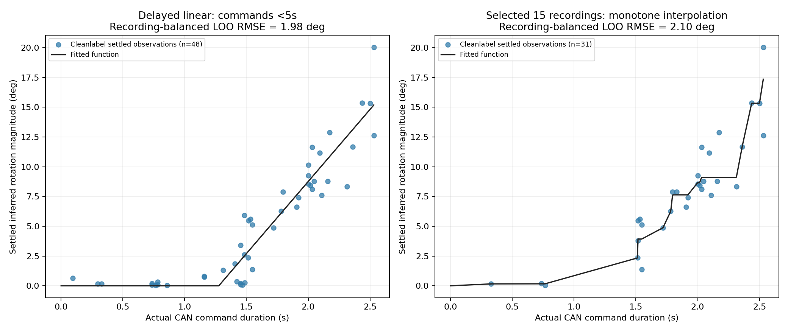

# Cleanlabel 재추론 및 두 적합 함수

모델: [CanelE452/pallet-pose-yolo26n-cleanlabel](https://huggingface.co/CanelE452/pallet-pose-yolo26n-cleanlabel)
고정 revision: `c40e610f46331fc385a7ec6b0ff41876142c075c` / SHA256: `4ee578e02810caae56b786c23a084121f4dfb33941e11d4d3fb216b9bfbbe60e`

## 재추론 및 입력 조건

- 기존 CAN 명령 구간 영상 23개, 4163프레임을 새 가중치로 직접 재추론.
- 유효 자세 3985/4163 (95.72%). 추론 루프 162.5초.
- 모델 정본 inference_config.yaml에 맞춰 100px BORDER_REFLECT_101 패딩 → imgsz 640 추론 → 좌표에서 100px 차감. conf 0.4, 최고 box confidence 인스턴스 선택, flip/TTA 미사용.
- 기존 라이브 다중 면 PnP 해석기는 유지. 원본별 카메라 내부 파라미터와 실측 팔레트 1.10×0.15×1.10m 사용. 패딩된 좌표로 PnP를 풀지 않음.
- yaw_deg를 heading 도메인으로 사용. yaw+heading이라는 두 각도를 더하는 방식이 아님. bearing을 차량 yaw로 대체하지 않음.
- CAN write-return 시각과 원본 frame_i를 보존한 촬영 시각 정렬을 사용. 잘라 붙인 영상 재생 시각으로 시간을 계산하지 않음.
- 연속 유효 프레임 간 >5° 튐 6건. 시간 간격 0.35초 초과, 누락 프레임, 잘라낸 간격은 비교하지 않음.
- 이전 endpoint를 재사용하지 않고 새 추론에서 명령 전/정지 후 안정 구간 중앙값 차이를 다시 추출. 안정성 기준은 이전과 동일.

## 방법 1: 5초 이상 제외, 지연시간 + 선형회귀

자동 로그 품질 검사를 통과한 48점 중 명령시간 ≥5초 0점 제외 → **48점 / 17개 녹화**.

기존 5.656초 명령(20260901_174342, step 7)은 새 로그에서 반복 튐과 명령 전 안정성 검사로 이미 제외되었다. 5초 이상 명령이 함수에 포함된 것은 아니다.

θ(T) = 12.102470 × max(T − 1.276363, 0) [deg]

양의 각도 역함수: T(θ) = 1.276363 + θ/12.102470 [s]. 각도 0이면 시간 0.
관측 명령시간 범위 0.093–2.531s. 정지시간도 각 교차검증 fold에서 다시 추정.
기울기는 최종 회전량에 대한 비례계수이고 지연시간은 유효 절편이다. 실제 최대 속도와 실제 움직임 시작 시각을 독립 측정한 값은 아니다.

## 방법 2: 이전 선택 15개 영상, 단조 구간선형 적합

선택 번호: 1, 3, 7, 10, 11, 12, 13, 14, 16, 18, 19, 20, 21, 22, 23.
명시적으로 선택한 영상에서는 영상 전체 자동 배제 대신 명령별 안정성 검사를 적용. 통과 **31점 / 12개 녹화**.
- 기존 선택 영상 방식과 동일하게 녹화별 총 가중치 1인 isotonic regression + knot 사이 선형 보간을 적용.
- 방법 1과 달리 원래 선택 영상 방식의 재현을 위해 ≥5초 명령을 추가 제외하지 않음. 파일에 기록된 실제 선택/통과점만 사용.
- 함수는 selected_fit/function_knots.csv의 (시간, 각도)를 연결. 역함수는 목표각도에 처음 도달하는 시간. 평탄 구간·드문 시간대에서 제어의 정밀도가 검증된 것은 아님.

## 적합도와 녹화 단위 교차검증

| 방법 | 점 수 | 적합 RMSE | 적합 R² | 교차검증 RMSE | 교차검증 R² | 녹화 동일가중 RMSE |
|---|---:|---:|---:|---:|---:|---:|
| Cleanlabel linear <5s | 48 | 1.694° | 0.889 | 1.891° | 0.861 | 1.982° |
| Cleanlabel selected isotonic | 31 | 1.539° | 0.887 | 2.344° | 0.739 | 2.098° |
| Previous C4 linear <5s | 44 | 1.997° | 0.840 | 2.279° | 0.791 | 2.435° |
| Previous C4 selected isotonic | 32 | 2.046° | 0.772 | 2.686° | 0.607 | 2.858° |

교차검증은 녹화 하나 전체를 제외한 뒤 응답함수를 다시 적합한다. 인식 모델 자체를 재학습하거나 독립 각도 정답으로 채점하는 검증은 아니다.
과거 C4와 새 모델은 전처리·검출 임계값·검출 대상 선택 및 통과 명령 집합이 다르다. 위 과거 수치는 참고용이며 순수 가중치 개선율 또는 두 적합 방법의 공정한 우열로 해석하면 안 된다.

## 사용 제한

- 안정된 추론은 실제 정지 또는 실제 물리 면 일치를 보장하지 않는다. STOP+2.7초 이후의 잔여 움직임은 이 데이터로 검증하지 못한다.
- 기존 카메라-회전축 실측값은 변경하지 않았다. heading은 방향각으로, 카메라 궤적의 bearing 변화와 구분한다.
- 새로운 환경/명령 길이의 일반화는 미검증. 원래 선택 영상 자체가 C4 관찰 후 선정되었다는 선택 편향이 남는다.
- 두 함수는 오프라인 진단 산출물. 제어 설정, 장비, 활성 모델은 변경하지 않았다.
- 20260903_191906은 59프레임 모두 유효 자세를 얻지 못했다. 전체 유효 자세 비율은 이전 C4 98.17%에서 이번 95.72%로 낮아졌으므로 적합 RMSE 개선만으로 전체 인식 성능 향상이라고 판단하지 않는다.

[선형회귀 JSON](linear_under5s/model.json) · [선형회귀 검증](linear_under5s/fit_validation.png) · [선택 영상 함수 JSON](selected_fit/endpoint_model.json) · [선택 영상 함수 knot](selected_fit/function_knots.csv) · [선택 영상 검증](selected_fit/fit_and_validation.png)
