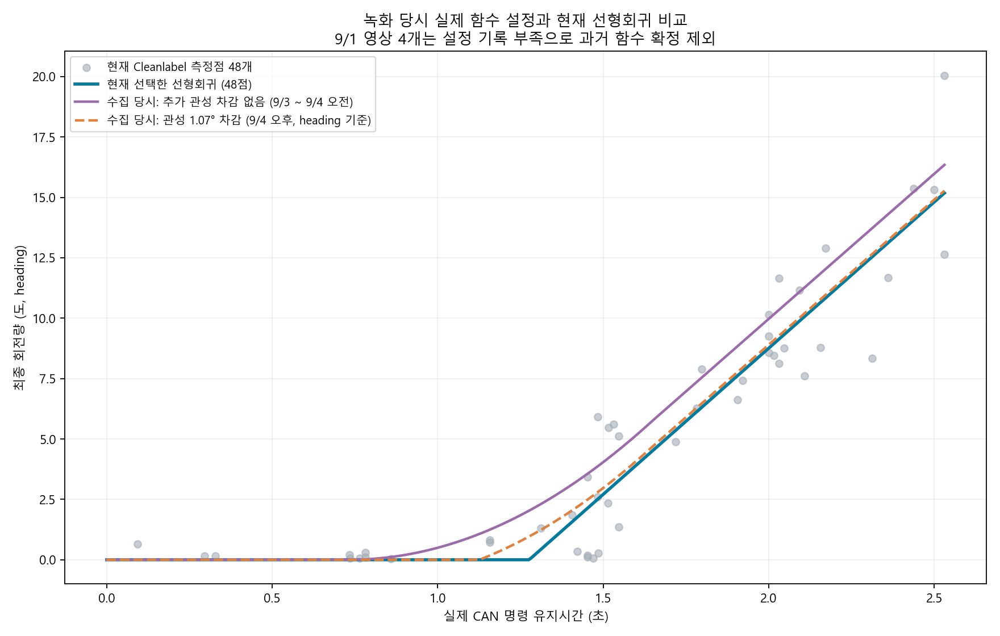

# 로그 수집 당시 실제 회전 함수와 현재 함수 비교

현재 코드에 남은 기본값을 과거 모든 녹화의 실제 설정으로 간주했던 이전 설명을 정정한다.
이 비교는 각 녹화의 `_meta.json`과 `_control_seq.jsonl`의 `begin.params.fitted_*`를 근거로 한다.

- 23개 영상 중 19개에 fitted-response 설정이 기록됨. 17개는 실제 계획 명령의 예측값까지 재현하여 확인했다.
- 9/1 영상 4개는 fitted-response 설정과 계획 기록이 없어 당시 함수를 확정하지 않는다.
- 20260903_191906, 20260904_105241은 설정은 있으나 fitted 계획 기록이 없어 계획값 대조 대상에서 제외했다.
- 확인된 9/3~9/4 오전 영상 11개: 물리 기본 함수, 추가 관성 차감 0도. 차감 필드는 없지만 모든 기록된 계획의 회전량이 차감 0일 때 1e-5도 이내로 재현된다.
- 확인된 9/4 오후 영상 6개: 같은 기본 물리 함수 + 관성 예측량에서 1.07도 차감. 메타데이터와 실제 계획값 모두 일치한다.
- 적응 시간 조절이 켜져 있던 오전 영상도 있으므로, 계획 유지시간을 실제 CAN 유지시간과 동일시하지 않는다. 실제 로그 비교에는 CAN 유지시간을 사용한다.

물리 기본 함수: 시작 지연 1.082초, STOP 지연 0.352초, 가속도 13.06°/s², 최대 속도 12.01°/s, 감속도 300°/s². 마지막 값은 과거 적합 상한이지 독립 실측값이 아니다.

현재 함수: `theta(T) = 12.10246966536945 * max(T - 1.276363332869698, 0)`.

| heading 목표 | 당시 차감 없음 | 당시 1.07° 차감 | 현재 선형회귀 |
|---|---:|---:|---:|
| 3° | 1.394s | 1.503s | 1.524s |
| 5° | 1.587s | 1.675s | 1.690s |
| 10° | 2.002s | 2.092s | 2.103s |

실제 CAN 시간·안정 endpoint·당시 함수/계획을 모두 연결한 40개 공통 측정점에서 기존 함수 RMSE 2.080도, 현재 함수 1.692도.
현재 함수가 학습에 사용한 데이터의 부분집합이고 관측값도 새로운 Cleanlabel 추정이므로, 이는 기술적 일치도 비교이지 독립 교차검증 개선 또는 물리적 정확도 향상의 증명은 아니다.

그래프는 heading 함수다. bearing 계획을 포함한 공통점 수치 비교에서는 계획에 기록된 변환 배율을 복원하고 1.07도 차감의 도메인도 변환했다. 당시 bearing 회전축 오프셋은 대부분 1.0m, 마지막 190446은 0.68m였으며 현재 설정을 과거 영상에 소급하지 않았다.

[영상별 근거](recording_function_audit.csv) · [공통 명령별 비교](same_command_comparison.csv) · [비교 수치 JSON](comparison.json)
