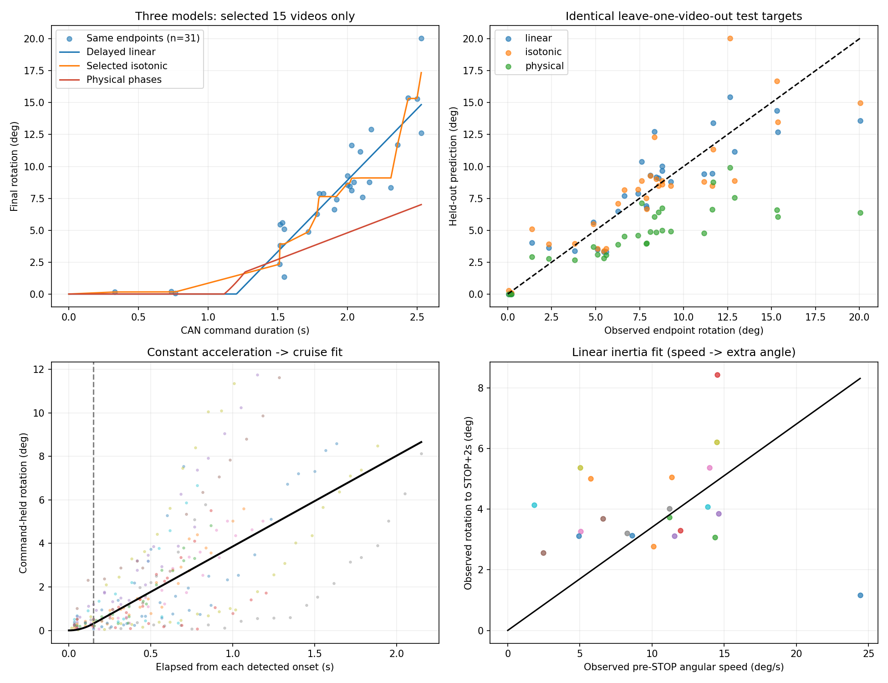

# 선택 15개 영상: 물리 구간 모델과 두 endpoint 모델 비교

선택 영상 15개만 사용. 5초 이상 명령 1개 제외. 물리 분석 명령 46개, 구동 사용 25개, 관성 사용 22개.
비교는 동일한 안정 구간 측정점 31개 / 12개 녹화에서 수행. 선택 영상 선형회귀도 이 데이터로 새로 적합했다(앞선 전체 48점 선형회귀와 다름).

## 물리 함수

정지시간 d = 1.115734s
등가속 시간 τ = 0.150000s, 가속도 a = 27.809066deg/s²
최대 속도 v = aτ = 4.171360deg/s
관성 추가각도 I(ω) = 0.000000 + 0.340239ω [deg] (ω>0; 정지 시 0)

명령시간 T에서 u=max(T-d,0), ω(T)=a·min(u,τ).
명령 중 회전량 D(T)=0.5·a·u² (u≤τ), 그 이후 D(T)=aτ·(u−τ/2).
최종 회전량 Θ(T)=D(T)+I(ω(T)). 역함수는 물리 모델의 command_duration()으로 계산할 수 있으나 진단용이다.

지연은 명령 뒤 최초 움직임의 프레임 구간에서 추정하고, 구동은 움직임 시작 이후 STOP 직전까지의 프레임 로그로 적합했다. 관성은 실제 STOP 직전 속도와 STOP+2초 추가각도로 적합했다.
관성 회귀에는 예측 속도가 아닌 로그에서 관측한 속도를 쓰고, 명령시간만으로 최종각도를 예측할 때는 구동 모델이 예측한 종료 속도를 쓴다.

## 동일 관측점 교차검증

| 방법 | 적합 RMSE | 적합 R² | 교차검증 RMSE | 교차검증 R² | 녹화 동일가중 RMSE | 예측점 |
|---|---:|---:|---:|---:|---:|---:|
| linear | 1.786° | 0.849 | 2.041° | 0.802 | 2.011° | 31/31 |
| isotonic | 1.539° | 0.887 | 2.344° | 0.739 | 2.098° | 31/31 |
| physical | 4.687° | -0.043 | 4.410° | 0.076 | 4.284° | 31/31 |

각 fold에서 물리 파라미터와 좌우 부호 판별도 학습 영상만으로 다시 계산했다. 테스트 영상의 중간 속도/회전량을 입력해 예측하지 않았다.

## 식별 가능성과 제한

등가속 시간 0.15초는 최적화 하한에 고착된 값이다. 실제 등가속 시간이 0.15초라고 측정된 것이 아니며, 가속도와 가속 시간을 독립적으로 신뢰하기 어렵다. 기존 적합기의 내부 identifiable 표시만으로 물리 파라미터가 검증되었다고 해석하면 안 된다.
- 동일점 검증에서 물리 모델의 RMSE 4.410°(녹화 동일가중 4.284°)로 기존 참고 기준 3°를 넘는다. 현재 결과는 제어용으로 부적합하다.
- 물리 모델은 가속·관성 추정을 위해 중간 프레임 로그가 필요하다. endpoint가 안정해도 중간 프레임이 안정하다는 보장은 없다.
- 구동/관성의 자체 적합 오차와 최종 회전량의 통합 예측 오차를 구분해야 한다.
- STOP+2초 관성과 STOP+2.7초 이내 안정 구간 사이의 차이도 최종 오차에 포함된다.
- 같은 영상/평가점이지만 훈련 입력은 다름: 물리 모델은 해당 15개 영상의 5초 미만 명령 추적 로그, 나머지는 안정 endpoint만 사용.
- 모든 값은 Cleanlabel 영상 추정치에 대한 일치도. 실측 정답 검증이나 장비 제어 적용은 하지 않았다.

[물리 함수](physical_model.json) · [구간별 실제 시각과 제외 사유](physical_segments.csv) · [동일점 예측 CSV](same_endpoint_predictions.csv) · [전체 비교 및 fold 결과](comparison.json)
